# DomainPostTrain

<p align="center">
  <a href="#chinese"><strong>中文</strong></a>
  &nbsp;|&nbsp;
  <a href="#architecture"><strong>架构图 / Architecture</strong></a>
  &nbsp;|&nbsp;
  <a href="#english"><strong>English</strong></a>
</p>

<a id="architecture"></a>

## 架构图 / Architecture

```mermaid
flowchart LR
    cptDocs["CPT 文档<br/>CPT documents<br/>data/cpt/source_documents"] --> cptDataset["CPT 数据集构造<br/>coverage + safety preflight"]
    cptDataset --> cptAdapter["CPT LoRA/QLoRA adapter<br/>outputs/lora_adapter"]

    sftRows["Fact-SFT 样例<br/>Fact-SFT examples<br/>data/sft"] --> sftStage["Fact-SFT<br/>assistant-only loss"]
    cptAdapter --> sftStage
    sftStage --> sftAdapter["Fact-SFT adapter<br/>outputs/fact_sft_adapter"]

    dpoRows["DPO 偏好样例<br/>DPO preferences<br/>data/dpo"] -.-> dpoStage["DPO 默认启用，可关闭<br/>enabled by default"]
    sftAdapter --> dpoStage
    dpoStage --> dpoAdapter["DPO adapter<br/>outputs/dpo_adapter"]

    grpoRows["GRPO 奖励样例<br/>GRPO reward prompts<br/>data/grpo"] -.-> grpoStage["GRPO 默认启用，可关闭<br/>enabled by default"]
    dpoAdapter --> grpoStage
    sftAdapter --> grpoStage
    grpoStage --> grpoAdapter["GRPO adapter<br/>outputs/grpo_adapter"]

    cptAdapter --> adapterChoice["Adapter 选择优先级<br/>GRPO / DPO / SFT / CPT"]
    sftAdapter --> adapterChoice
    dpoAdapter --> adapterChoice
    grpoAdapter --> adapterChoice
    adapterChoice --> mergedModel["合并模型<br/>Merged model<br/>outputs/merged_model"]

    evalSet["质量评估题集<br/>Quality questions<br/>data/eval"] --> qualityEval["训练后质量评估<br/>Post-training evaluation"]
    mergedModel --> qualityEval
    mergedModel --> inference["推理服务<br/>OpenAI-compatible API"]
    mergedModel --> exportPath["模型导出<br/>GGUF default / ONNX optional"]
```



<a id="chinese"></a>

## 中文

DomainPostTrain 是一个通用领域后训练管道示例，用于把静态领域文档、事实问答样例和偏好样例组织成可复现的 LLM 后训练流程：

```text
CPT -> Fact-SFT -> optional DPO -> optional GRPO -> merge -> quality eval -> inference/export
```

本仓库只包含静态 mock 数据。示例领域是 `AsterHelp`，一个虚构的内部支持知识库助手。训练真实模型前，请替换为你拥有合法使用权的领域文档、SFT 样例、DPO 偏好样例和质量评估题集。

### 能力范围

- CPT 语料发现、语料安全预检、必覆盖数据集构造和覆盖报告。
- PEFT LoRA/QLoRA 领域继续预训练式适配。
- Fact-SFT assistant-only loss，只训练 assistant answer token。
- DPO 偏好训练默认启用但可关闭，输入为完整 `prompt` / `chosen` / `rejected`。
- GRPO 奖励优化默认启用但可关闭，默认由外部 OpenAI-compatible Judge 对 prompt 的候选回答评分。
- Adapter merge、训练后质量评估、单条推理、OpenAI-compatible Flask 服务。
- 从 merge 后 Hugging Face 模型导出 GGUF；ONNX 导出作为可选路径。

### 项目结构

```text
configs/                 # 默认配置和中英文参数手册
data/                    # 静态 mock CPT/SFT/DPO/GRPO/eval 数据
pipeline/                # 可复用训练、数据、评估、导出逻辑
scripts/training/        # CPT、Fact-SFT、DPO、GRPO 和完整流水线入口
scripts/model_artifacts/ # 模型下载、adapter merge、GGUF/ONNX 导出
scripts/inference/       # 单条推理、质量评估、DPO rejected 补全
scripts/diagnostics/     # 本地训练环境检查
serve_inference.py       # Flask + OpenAI-compatible API 服务
```

更细的脚本说明见 `scripts/README.md`。完整配置说明见 `configs/README.md`。

### 数据约定

```text
data/cpt/source_documents/*.md      # CPT 源文档
data/sft/*.jsonl                    # Fact-SFT 样例
data/dpo/preference_examples.jsonl  # DPO 偏好样例
data/grpo/reward_examples.jsonl     # GRPO 奖励样例
data/eval/quality_questions.jsonl   # 训练后质量评估题集
```

仓库不包含 mock 数据生成脚本，只保留已经生成好的静态示例数据。字段约定：

- SFT: 每行包含 `instruction` 和 `output`。
- DPO: 每行包含 `prompt`、`chosen`、`rejected`，且 `chosen != rejected`。
- GRPO: 每行包含 `prompt`；默认 Judge 模式允许只有 `prompt`。私域依据应放在 `trusted_context`（兼容 `judge_context` / `context`）或 `reference_answer`，禁止词可用 `forbidden_terms_mode: semantic|literal` 明确语义/字面规则。关闭 Judge 时需提供与已启用内置奖励匹配的字段。
- Quality eval: 每行包含 `category` 和 `question`，`category` 支持 `domain_knowledge`、`safety_boundary`、`base_regression`。

发布派生仓库前，不要把私有文档、客户数据、凭据、私有 system prompt、源代码或许可证受限语料放进 `data/`。更多说明见 `data/README.md` 和 `SECURITY.md`。

### 安装

默认依赖面向 CUDA 12.6 GPU 训练环境，`requirements.txt` 中包含 PyTorch CUDA wheel 索引。若你的 CUDA、Python ABI 或运行环境不同，先安装匹配的 PyTorch，再安装其余依赖。

Linux/macOS:

```bash
python -m venv .venv
source .venv/bin/activate
python -m pip install --upgrade pip
python -m pip install -r requirements.txt
```

Windows PowerShell:

先运行 `python --version` 确认解释器确实可用。若 WindowsApps 的 `python.exe` 别名无输出，改用 `py --version`、`py -3.10`，或直接调用虚拟环境中的 `.venv\Scripts\python.exe`。

```powershell
py -3.10 -m venv .venv
& .\.venv\Scripts\python.exe -m pip install --upgrade pip
& .\.venv\Scripts\python.exe -m pip install -r requirements.txt
```

ONNX 导出不在默认路径里。只有运行 `scripts/model_artifacts/export_onnx.py` 时才需要：

```bash
python -m pip install -r requirements-onnx.txt
```

离线或私有 wheelhouse 环境建议顺序安装：先安装匹配的 `torch` / `torchvision` / `torchaudio` wheel，再安装 `requirements.txt` 中除 torch 外的依赖。ONNX GPU 导出还需要额外准备 ONNX Runtime 的 CUDA runtime wheel。

### 配置

默认配置文件是 `configs/domain_post_training.yaml`：

```yaml
base_model_repo_id: "Qwen/Qwen3.5-0.8B"
base_model_name_or_path: "models/base-model"
```

`base_model_repo_id` 是 `download_models.py` 使用的 Hub 下载来源；`base_model_name_or_path` 是训练、merge、评估和推理实际加载的位置。下载脚本会把前者保存到后者指向的本地目录；如果模型已在本地，只需正确设置后者。

真实训练应复制到 Git 忽略的私有配置再修改，尤其是直接填写 `grpo.reward_judge.api_key` 时：

```powershell
Copy-Item configs/domain_post_training.yaml configs/domain_post_training.local.yaml
```

Linux/macOS 使用 `cp configs/domain_post_training.yaml configs/domain_post_training.local.yaml`。受跟踪模板必须保持 `reward_judge.api_key: null`。DPO 和 GRPO 在默认配置中均已开启；启动训练前需要准备对应数据，并为默认 Judge 补齐 `base_url`、`model` 和 `api_key`。

然后替换这些内容：

- `corpus.input_paths`: 你的 CPT 文档路径。
- `fact_sft.input_paths`: 你的 Fact-SFT JSONL 路径。
- `dpo.input_path`: 你的 DPO 偏好数据路径。
- `grpo.input_path`: 你的 GRPO 奖励提示数据路径。
- `eval.question_file`: 你的训练后质量评估题集。
- `fact_sft.system_prompt`: 你的领域角色、知识边界和安全边界。
- `base_model_repo_id` / `base_model_name_or_path`: 你的基座模型。

完整参数说明见 `configs/README.md`。

下载配置中的 Hugging Face 模型：

```bash
python scripts/model_artifacts/download_models.py --config configs/domain_post_training.yaml
```

也可以直接把 `base_model_name_or_path` 指向已有的本地模型目录。

### 快速自检

Smoke test 会创建一个很小的本地模型到 `outputs/smoke/base_model`，用于验证配置加载、语料发现、数据集准备、PEFT adapter 保存、merge 和报告链路。它不会下载默认基座模型。

```bash
python scripts/training/train_pipeline.py --config configs/domain_post_training.yaml --smoke_test --device cpu
```

如果本机依赖不足，至少运行静态检查：

```bash
python -m compileall pipeline scripts serve_inference.py
```

### 完整训练

```bash
python scripts/training/train_pipeline.py --config configs/domain_post_training.local.yaml
```

主要输出：

- CPT adapter: `outputs/lora_adapter/`
- Fact-SFT adapter: `outputs/fact_sft_adapter/`
- DPO adapter: `outputs/dpo_adapter/`，仅当 `dpo.enabled=true`
- GRPO adapter: `outputs/grpo_adapter/`，仅当 `grpo.enabled=true`
- 合并模型: `outputs/merged_model/`
- CPT 覆盖报告: `outputs/cpt_dataset/coverage_report.md`
- 训练后质量评估报告: `outputs/eval/eval_report.md`
- 总报告: `outputs/reports/pipeline_report.md`

可以显式跳过阶段：

```bash
python scripts/training/train_pipeline.py --config configs/domain_post_training.local.yaml --skip_cpt
python scripts/training/train_pipeline.py --config configs/domain_post_training.local.yaml --skip_cpt --skip_sft
python scripts/training/train_pipeline.py --config configs/domain_post_training.local.yaml --skip_cpt --skip_sft --skip_dpo
python scripts/training/train_pipeline.py --config configs/domain_post_training.local.yaml --skip_cpt --skip_sft --skip_dpo --skip_grpo
```

一次命令退出码为 `0` 或报告显示 `completed`，不能单独证明训练有效。本项目推荐四阶段都使用 `bf16: auto`、`fp16: auto`、`torch_dtype: auto`，并保持 `abort_on_nonfinite_grad_norm: true`：支持 BF16 的 CUDA 设备会优先使用 BF16，其他 CUDA 设备回退到 FP16，CPU 关闭两种混合精度。验收时还要确认各阶段 `grad_norm` 有限，并比较相邻阶段 adapter 的 LoRA tensor 确实发生变化。

### 验证集和质量评估

训练时 validation set 和训练后 quality evaluation 是两件事：

- validation set 用于训练过程中的 loss/eval signal。
- quality evaluation 用于训练完成后检查事实回答、安全拒答和基础能力回归。当前评估器是启发式 smoke gate，不是安全认证；生产验收还需人工或独立 Judge 复核安全样例。

当前 mock 数据很小，所以默认不切训练验证集：

```yaml
corpus:
  validation_mode: "none"
fact_sft:
  validation_ratio: 0
dpo:
  validation_ratio: 0
```

真实项目建议打开验证集。CPT 优先使用独立 held-out 文档：

```yaml
corpus:
  validation_mode: "separate_sources"
  validation_sources:
    - "../data/cpt_validation/source_documents"
```

Fact-SFT 和 DPO 在数据量足够时可以设置 `validation_ratio: 0.05` 到 `0.1`。

训练后质量评估从 `eval.question_file` 读取 JSONL 题集：

```bash
python scripts/inference/run_quality_evaluation.py --config configs/domain_post_training.yaml --targets merged
```

替换领域时，优先替换 `data/eval/quality_questions.jsonl`，不需要修改 `pipeline/evaluation.py`。

### DPO

仓库内置一个小型静态偏好文件：`data/dpo/preference_examples.jsonl`。DPO 默认开启；不需要时设置 `enabled: false`：

```yaml
dpo:
  enabled: true
  input_path: "data/dpo/preference_examples.jsonl"
```

DPO 样例必须包含非空 `prompt`、`chosen`、`rejected`，并且 `chosen` 不能和 `rejected` 相同。

### GRPO

GRPO 在 DPO、Fact-SFT 或 CPT 之后运行，生成多条候选回答并用奖励函数优化策略。默认使用一个 OpenAI-compatible 外部大模型作为 Judge：

```yaml
grpo:
  enabled: true
  input_path: "data/grpo/reward_examples.jsonl"
  num_generations: 4
  builtin_rewards: []
  reward_judge:
    enabled: true
    base_url: "http://localhost:8000/v1"
    api_key: "replace-with-your-key"
    model: "local-reward-judge"
    timeout_seconds: 120
    max_tokens: 4096
```

默认直接从私有 `configs/domain_post_training.local.yaml` 的 `api_key` 读取凭据。该字段是明文敏感信息，不要把真实 Key 提交到版本库。若不希望在 YAML 中保存 Key，可将 `api_key` 留空，并使用 `api_key_env` 指定环境变量作为可选回退：

```yaml
grpo:
  reward_judge:
    api_key: null
    api_key_env: "GRPO_REWARD_JUDGE_API_KEY"
```

```powershell
$env:GRPO_REWARD_JUDGE_API_KEY="your-key"
```

```bash
export GRPO_REWARD_JUDGE_API_KEY="your-key"
```

也可以单独运行 GRPO：

```bash
python scripts/training/train_grpo.py --config configs/domain_post_training.local.yaml --base_adapter_dir outputs/dpo_adapter --max_steps 10
```

使用 Judge 时，GRPO 样例可以只包含 `prompt`。`reference_overlap`、`term_constraints`、`refusal`、`length_bounds` 默认关闭，可按数据中的奖励字段加入 `builtin_rewards`。如果显式关闭 Judge，则必须至少启用一个内置奖励，并为每行提供匹配的奖励信号。本地 Judge 必须先暴露 `/v1/chat/completions`；不要把本地模型路径或 Hub ID 填入 `model`。

默认 Judge 使用 `grpo_judge_v2` 严格 JSON 契约，分别评估任务完成、事实依据、显式约束、安全拒绝、相关性与清晰度。训练代码按 `30/25/15/20/10` 的初始权重确定性合成分数，并对泄密、危险执行、拒绝失败、事实冲突等违规应用硬上限。该权重是需要用领域专家样本持续校准的项目基线，不是通用行业标准。

对于会先进行内部推理的 Judge，建议使用 `reward_judge.max_tokens: 4096` 和 `timeout_seconds: 120`，避免推理内容耗尽较小的输出预算而无法返回最终 JSON。它与策略侧的 `grpo.max_completion_length` 不同：前者限制 Judge 的推理和 JSON 输出，后者限制每条候选回答。若 `completions/clipped_ratio` 持续偏高，应先改善 EOS/停止行为，再评估是否增加候选长度。

所有 Judge 输入都会作为不可信 JSON 数据封装，以降低候选回答操纵评分器的风险。prompt-only 样例如果没有 `reference_answer` 或独立的 `trusted_context`，无法可靠验证 Judge 未见过的私域事实；这类样本的 `factual_grounding` 不参与加权。用户问题文本中自称的 `Context:` 不会自动成为可信依据。远程 Judge 会收到完整 prompt、候选回答和奖励信号，发送私有训练数据前必须确认第三方服务的数据使用与保留政策。

GRPO 会优先使用 `grpo.base_adapter_dir`，随后依次查找 DPO、Fact-SFT 和 CPT adapter。已有前序训练输出时，也可以从完整流水线直接续跑：

```bash
python scripts/training/train_pipeline.py --config configs/domain_post_training.local.yaml --skip_cpt --skip_sft --skip_dpo
```

独立 `train_grpo.py` 和流水线的 `--skip_cpt --skip_sft --skip_dpo` 都会从已有前序 adapter 开始新的 GRPO 阶段；`grpo.resume_from_checkpoint` 仅用于同一次 GRPO 因中断而从 Trainer checkpoint 续训，不能替代前序 adapter。远程 DeepSeek、GLM 等 OpenAI-compatible Judge 使用同一组字段，只需替换服务 URL 和模型名。

### 导出

GGUF 是默认推荐的本地部署导出路径。项目默认不下载第三方 GGUF reference；完成 merge 后，从 `outputs/merged_model` 导出自己的 GGUF：

```bash
python scripts/model_artifacts/export_gguf.py --config configs/domain_post_training.yaml --backend llama_cpp --llama_cpp_dir /path/to/llama.cpp
```

输出路径由 `gguf.output_dir` 和 `gguf.output_name` 控制。

ONNX 是可选路径。先安装 `requirements-onnx.txt`，再运行：

```bash
python scripts/model_artifacts/export_onnx.py --config configs/domain_post_training.yaml
```

### 推理和服务

单条本地推理：

```bash
python scripts/inference/run_inference.py --config configs/domain_post_training.yaml --model_path outputs/merged_model "What can this assistant answer from the documentation?"
```

启动 Flask 服务：

```bash
python serve_inference.py --host 0.0.0.0 --port 8000 --model_path outputs/merged_model
```

服务接口：

- OpenAPI JSON: `http://localhost:8000/openapi.json`
- 文档页面: `http://localhost:8000/docs`
- OpenAI-compatible models: `GET http://localhost:8000/v1/models`
- OpenAI-compatible chat completions: `POST http://localhost:8000/v1/chat/completions`
- 简单生成接口: `POST http://localhost:8000/generate`

OpenAI-compatible 请求示例：

```bash
curl http://localhost:8000/v1/chat/completions \
  -H "Content-Type: application/json" \
  -d '{
    "model": "local-domain-model",
    "messages": [{"role": "user", "content": "What can this assistant answer from the documentation?"}],
    "temperature": 0,
    "max_tokens": 128
  }'
```

### 发布前检查

开源或发布派生项目之前，建议至少检查：

```bash
python -m compileall pipeline scripts serve_inference.py
```

并确认：

- `data/` 只包含可公开、可授权使用的语料。
- `configs/domain_post_training.yaml` 保持 `api_key: null`，私有 `configs/domain_post_training.local.yaml` 未进入 staged snapshot。
- staged snapshot、必要时的 Git 历史和 `outputs/` 已完成不打印密钥值的扫描，真实 Key 精确匹配数为 `0`。
- `outputs/`、`models/`、`.venv/`、`__pycache__/` 和训练产物没有被提交。
- `data/eval/quality_questions.jsonl` 是训练后质量评估题集，不是训练 validation set。

贡献前请阅读 `CONTRIBUTING.md`。安全注意事项见 `SECURITY.md`。

### 许可证

代码和内置 mock 数据使用 Apache License 2.0 发布。你需要自行确认替换进来的基础模型、外部数据集或领域文档的许可证要求。

<p align="right"><a href="#english"><strong>Switch to English</strong></a></p>

<a id="english"></a>

## English

DomainPostTrain is a general post-training pipeline example for organizing static domain documents, factual SFT examples, and preference examples into a reproducible LLM post-training workflow:

```text
CPT -> Fact-SFT -> optional DPO -> optional GRPO -> merge -> quality eval -> inference/export
```

This repository ships only static mock data. The sample domain is `AsterHelp`, a fictional internal support knowledge-base assistant. Before training a real model, replace the mock corpus, SFT examples, DPO preference pairs, and quality evaluation questions with data you are licensed to use.

### Scope

- CPT corpus discovery, corpus safety preflight, mandatory-coverage dataset construction, and coverage reports.
- PEFT LoRA/QLoRA continued-pretraining-style domain adaptation.
- Fact-SFT with assistant-only loss, so only assistant answer tokens are trained.
- DPO preference training is enabled by default but can be disabled; rows contain complete `prompt` / `chosen` / `rejected` values.
- GRPO reward optimization is enabled by default but can be disabled; an external OpenAI-compatible judge scores candidate completions by default.
- Adapter merge, post-training quality evaluation, single-text inference, and an OpenAI-compatible Flask service.
- GGUF export from the merged Hugging Face model; ONNX export is optional.

### Project Layout

```text
configs/                 # default config and bilingual parameter reference
data/                    # static mock CPT/SFT/DPO/GRPO/eval data
pipeline/                # reusable training, data, evaluation, and export logic
scripts/training/        # CPT, Fact-SFT, DPO, GRPO, and full-pipeline entrypoints
scripts/model_artifacts/ # model download, adapter merge, GGUF/ONNX export
scripts/inference/       # inference, quality evaluation, DPO rejected-answer filling
scripts/diagnostics/     # local training environment checks
serve_inference.py       # Flask + OpenAI-compatible API service
```

See `scripts/README.md` for script grouping and `configs/README.md` for the full configuration reference.

### Data Contracts

```text
data/cpt/source_documents/*.md      # CPT source documents
data/sft/*.jsonl                    # Fact-SFT examples
data/dpo/preference_examples.jsonl  # DPO preference examples
data/grpo/reward_examples.jsonl     # GRPO reward examples
data/eval/quality_questions.jsonl   # post-training quality evaluation questions
```

No mock data generator is included. The repository keeps only static example data:

- SFT: each row has `instruction` and `output`.
- DPO: each row has `prompt`, `chosen`, and `rejected`, with `chosen != rejected`.
- GRPO: each row has `prompt`; the default judge mode allows prompt-only rows. Put private-domain evidence in `trusted_context` (aliases: `judge_context` / `context`) or `reference_answer`, and use `forbidden_terms_mode: semantic|literal` to make forbidden-term semantics explicit. Built-in-only mode requires fields matching an enabled reward.
- Quality eval: each row has `category` and `question`; supported categories are `domain_knowledge`, `safety_boundary`, and `base_regression`.

Before publishing a derivative repository, do not put private documents, customer data, credentials, private system prompts, source code, or license-restricted corpora under `data/`. See `data/README.md` and `SECURITY.md`.

### Install

The default dependency file targets CUDA 12.6 GPU training and includes the PyTorch CUDA wheel index. If your CUDA runtime, Python ABI, or deployment environment differs, install the matching PyTorch build first and then install the remaining dependencies.

Linux/macOS:

```bash
python -m venv .venv
source .venv/bin/activate
python -m pip install --upgrade pip
python -m pip install -r requirements.txt
```

Windows PowerShell:

Run `python --version` first and confirm that the interpreter actually responds. If the WindowsApps `python.exe` alias produces no output, use `py --version`, `py -3.10`, or call `.venv\Scripts\python.exe` directly.

```powershell
py -3.10 -m venv .venv
& .\.venv\Scripts\python.exe -m pip install --upgrade pip
& .\.venv\Scripts\python.exe -m pip install -r requirements.txt
```

ONNX export is not part of the default path. Install it only when running `scripts/model_artifacts/export_onnx.py`:

```bash
python -m pip install -r requirements-onnx.txt
```

For offline or private wheelhouse environments, install matching `torch` / `torchvision` / `torchaudio` wheels first, then the non-torch dependencies from `requirements.txt`. ONNX GPU export also requires ONNX Runtime CUDA runtime wheels.

### Configure

The default config is `configs/domain_post_training.yaml`:

```yaml
base_model_repo_id: "Qwen/Qwen3.5-0.8B"
base_model_name_or_path: "models/base-model"
```

`base_model_repo_id` is the Hub download source used by `download_models.py`. `base_model_name_or_path` is what training, merge, evaluation, and inference actually load. The downloader saves the former into the local directory named by the latter; if a local model already exists, set only the latter correctly.

For real training, copy the template to the Git-ignored private config, especially when storing `grpo.reward_judge.api_key` directly:

```powershell
Copy-Item configs/domain_post_training.yaml configs/domain_post_training.local.yaml
```

On Linux/macOS, run `cp configs/domain_post_training.yaml configs/domain_post_training.local.yaml`. The tracked template must keep `reward_judge.api_key: null`. DPO and GRPO are enabled in the default config, so prepare both datasets and configure the default judge's `base_url`, `model`, and `api_key` before training.

Replace these first:

- `corpus.input_paths`: your CPT documents.
- `fact_sft.input_paths`: your Fact-SFT JSONL files.
- `dpo.input_path`: your DPO preference data.
- `grpo.input_path`: your GRPO reward-prompt data.
- `eval.question_file`: your post-training quality evaluation question set.
- `fact_sft.system_prompt`: your assistant role, knowledge boundary, and safety boundary.
- `base_model_repo_id` / `base_model_name_or_path`: your base model.

See `configs/README.md` for the full bilingual parameter reference.

Download the configured Hugging Face model:

```bash
python scripts/model_artifacts/download_models.py --config configs/domain_post_training.yaml
```

You may also point `base_model_name_or_path` directly to an existing local model directory.

### Quick Smoke Test

The smoke test creates a tiny local model under `outputs/smoke/base_model`. It validates config loading, corpus discovery, dataset preparation, PEFT adapter saving, merge, and report generation without downloading the default base model.

```bash
python scripts/training/train_pipeline.py --config configs/domain_post_training.yaml --smoke_test --device cpu
```

If local ML dependencies are unavailable, run at least the static check:

```bash
python -m compileall pipeline scripts serve_inference.py
```

### Full Training

```bash
python scripts/training/train_pipeline.py --config configs/domain_post_training.local.yaml
```

Important outputs:

- CPT adapter: `outputs/lora_adapter/`
- Fact-SFT adapter: `outputs/fact_sft_adapter/`
- DPO adapter: `outputs/dpo_adapter/`, only when `dpo.enabled=true`
- GRPO adapter: `outputs/grpo_adapter/`, only when `grpo.enabled=true`
- Merged model: `outputs/merged_model/`
- CPT coverage report: `outputs/cpt_dataset/coverage_report.md`
- Post-training quality evaluation report: `outputs/eval/eval_report.md`
- Pipeline report: `outputs/reports/pipeline_report.md`

Stage skipping is explicit:

```bash
python scripts/training/train_pipeline.py --config configs/domain_post_training.local.yaml --skip_cpt
python scripts/training/train_pipeline.py --config configs/domain_post_training.local.yaml --skip_cpt --skip_sft
python scripts/training/train_pipeline.py --config configs/domain_post_training.local.yaml --skip_cpt --skip_sft --skip_dpo
python scripts/training/train_pipeline.py --config configs/domain_post_training.local.yaml --skip_cpt --skip_sft --skip_dpo --skip_grpo
```

Exit code `0` or a `completed` report is not, by itself, proof that training updated the model. Keep all four stages on `bf16: auto`, `fp16: auto`, and `torch_dtype: auto`, with `abort_on_nonfinite_grad_norm: true`: BF16-capable CUDA devices prefer BF16, other CUDA devices fall back to FP16, and CPU disables both mixed-precision modes. Acceptance also requires finite `grad_norm` values at every stage and actual LoRA tensor changes between adjacent adapters.

### Validation And Quality Evaluation

The training validation set and post-training quality evaluation are separate concerns:

- A validation set provides loss/eval signals during training.
- Quality evaluation checks factual answers, safe refusals, and base-capability regressions after training. The current evaluator is a heuristic smoke gate, not a safety certification; production acceptance needs human or independent-judge review of safety examples.

The mock dataset is intentionally small, so training validation is disabled by default:

```yaml
corpus:
  validation_mode: "none"
fact_sft:
  validation_ratio: 0
dpo:
  validation_ratio: 0
```

For real projects, enable validation. For CPT, prefer independent held-out documents:

```yaml
corpus:
  validation_mode: "separate_sources"
  validation_sources:
    - "../data/cpt_validation/source_documents"
```

For Fact-SFT and DPO, set `validation_ratio: 0.05` to `0.1` when enough data is available.

Post-training quality evaluation reads the JSONL question set from `eval.question_file`:

```bash
python scripts/inference/run_quality_evaluation.py --config configs/domain_post_training.yaml --targets merged
```

When replacing the sample domain, replace `data/eval/quality_questions.jsonl` instead of editing `pipeline/evaluation.py`.

### DPO

The repository includes a small static preference file at `data/dpo/preference_examples.jsonl`. DPO is enabled by default; set `enabled: false` when the stage is not needed:

```yaml
dpo:
  enabled: true
  input_path: "data/dpo/preference_examples.jsonl"
```

Every DPO row must contain non-empty `prompt`, `chosen`, and `rejected` fields, and `chosen` must differ from `rejected`.

### GRPO

GRPO runs after DPO, Fact-SFT, or CPT, generates multiple candidate completions, and optimizes the policy with reward functions. By default, it uses one external OpenAI-compatible LLM as the judge:

```yaml
grpo:
  enabled: true
  input_path: "data/grpo/reward_examples.jsonl"
  num_generations: 4
  builtin_rewards: []
  reward_judge:
    enabled: true
    base_url: "http://localhost:8000/v1"
    api_key: "replace-with-your-key"
    model: "local-reward-judge"
    timeout_seconds: 120
    max_tokens: 4096
```

By default, the credential is read directly from `api_key` in private `configs/domain_post_training.local.yaml`. This is a plaintext secret; never commit a real key. To avoid storing the key in YAML, leave `api_key` empty and set `api_key_env` as an optional fallback:

```yaml
grpo:
  reward_judge:
    api_key: null
    api_key_env: "GRPO_REWARD_JUDGE_API_KEY"
```

```powershell
$env:GRPO_REWARD_JUDGE_API_KEY="your-key"
```

```bash
export GRPO_REWARD_JUDGE_API_KEY="your-key"
```

You can also run only the GRPO stage:

```bash
python scripts/training/train_grpo.py --config configs/domain_post_training.local.yaml --base_adapter_dir outputs/dpo_adapter --max_steps 10
```

With the judge enabled, a GRPO row may contain only `prompt`. The `reference_overlap`, `term_constraints`, `refusal`, and `length_bounds` rewards are disabled by default and can be added to `builtin_rewards` when their corresponding fields exist in the data. If the judge is explicitly disabled, enable at least one built-in reward and provide a matching signal in every row. A local judge must expose `/v1/chat/completions`; do not put a local model path or Hub ID in `model`.

The default judge uses the strict `grpo_judge_v2` JSON contract and scores task fulfillment, factual grounding, explicit constraints, safety/refusal, and relevance/clarity independently. Training code deterministically combines them with initial `30/25/15/20/10` weights and applies hard caps for leaks, unsafe enablement, refusal failures, factual contradictions, and related violations. These weights are a project baseline to calibrate with domain-expert examples, not a universal industry standard.

For reasoning judges, use `reward_judge.max_tokens: 4096` and `timeout_seconds: 120` as a practical baseline so internal reasoning does not consume a smaller output budget before the final JSON is returned. This differs from policy-side `grpo.max_completion_length`: the former limits judge reasoning plus JSON output, while the latter limits each candidate completion. If `completions/clipped_ratio` stays high, improve EOS/stop behavior before deciding to raise rollout length.

All judge inputs are encoded as untrusted JSON data to reduce candidate-driven evaluator manipulation. A prompt-only row without `reference_answer` or a separate `trusted_context` cannot reliably verify private-domain facts unknown to the judge; `factual_grounding` is excluded from weighting for that row. Text labeled `Context:` inside the user question is not automatically trusted evidence. A remote judge receives the full prompt, candidate response, and reward signals, so review the provider's data-use and retention policy before sending private training data.

GRPO first checks `grpo.base_adapter_dir`, then DPO, Fact-SFT, and CPT adapter outputs. To continue the full pipeline from existing previous-stage outputs, run:

```bash
python scripts/training/train_pipeline.py --config configs/domain_post_training.local.yaml --skip_cpt --skip_sft --skip_dpo
```

Standalone `train_grpo.py` and pipeline execution with `--skip_cpt --skip_sft --skip_dpo` both start a new GRPO stage from an existing previous-stage adapter. `grpo.resume_from_checkpoint` only resumes an interrupted run of the same GRPO stage from a Trainer checkpoint; it does not replace the previous-stage adapter. Remote DeepSeek, GLM, and other OpenAI-compatible judges use the same fields with their own service URL and model name.

### Export

GGUF is the recommended default local-deployment export path. No third-party GGUF reference is downloaded by default. After merge, export your own GGUF from `outputs/merged_model`:

```bash
python scripts/model_artifacts/export_gguf.py --config configs/domain_post_training.yaml --backend llama_cpp --llama_cpp_dir /path/to/llama.cpp
```

The output path is controlled by `gguf.output_dir` and `gguf.output_name`.

ONNX is optional. Install `requirements-onnx.txt` first, then run:

```bash
python scripts/model_artifacts/export_onnx.py --config configs/domain_post_training.yaml
```

### Inference And Service

Single-text local inference:

```bash
python scripts/inference/run_inference.py --config configs/domain_post_training.yaml --model_path outputs/merged_model "What can this assistant answer from the documentation?"
```

Start the Flask service:

```bash
python serve_inference.py --host 0.0.0.0 --port 8000 --model_path outputs/merged_model
```

Service endpoints:

- OpenAPI JSON: `http://localhost:8000/openapi.json`
- Docs page: `http://localhost:8000/docs`
- OpenAI-compatible models: `GET http://localhost:8000/v1/models`
- OpenAI-compatible chat completions: `POST http://localhost:8000/v1/chat/completions`
- Simple generation: `POST http://localhost:8000/generate`

OpenAI-compatible request example:

```bash
curl http://localhost:8000/v1/chat/completions \
  -H "Content-Type: application/json" \
  -d '{
    "model": "local-domain-model",
    "messages": [{"role": "user", "content": "What can this assistant answer from the documentation?"}],
    "temperature": 0,
    "max_tokens": 128
  }'
```

### Release Checklist

Before open-sourcing or publishing a derivative project, run at least:

```bash
python -m compileall pipeline scripts serve_inference.py
```

Then confirm:

- `data/` contains only public, licensed, publishable data.
- `configs/domain_post_training.yaml` keeps `api_key: null`, and private `configs/domain_post_training.local.yaml` is absent from the staged snapshot.
- The staged snapshot, Git history when relevant, and `outputs/` have been scanned without printing secret values; the exact real-key match count is `0`.
- `outputs/`, `models/`, `.venv/`, `__pycache__/`, and training artifacts are not committed.
- `data/eval/quality_questions.jsonl` is the post-training quality evaluation set, not the training validation set.

Read `CONTRIBUTING.md` before contributing. See `SECURITY.md` for security guidance.

### License

Code and included mock data are released under the Apache License 2.0. You are responsible for checking the license terms of any base model, external dataset, or domain documents you substitute into this pipeline.

<p align="right"><a href="#chinese"><strong>返回中文</strong></a></p>
