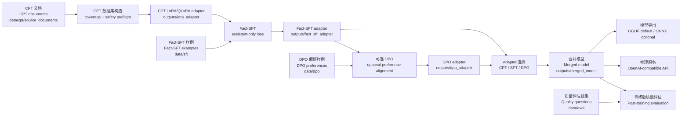

# DomainPostTrain

<p align="center">
  <a href="#chinese"><strong>中文</strong></a>
  &nbsp;|&nbsp;
  <a href="#architecture"><strong>架构图 / Architecture</strong></a>
  &nbsp;|&nbsp;
  <a href="#english"><strong>English</strong></a>
</p>

<a id="architecture"></a>

## 架构图 / Architecture



<a id="chinese"></a>

## 中文

DomainPostTrain 是一个通用领域后训练管道示例，用于把静态领域文档、事实问答样例和偏好样例组织成可复现的 LLM 后训练流程：

```text
CPT -> Fact-SFT -> optional DPO -> merge -> quality eval -> inference/export
```

本仓库只包含静态 mock 数据。示例领域是 `AsterHelp`，一个虚构的内部支持知识库助手。训练真实模型前，请替换为你拥有合法使用权的领域文档、SFT 样例、DPO 偏好样例和质量评估题集。

### 能力范围

- CPT 语料发现、语料安全预检、必覆盖数据集构造和覆盖报告。
- PEFT LoRA/QLoRA 领域继续预训练式适配。
- Fact-SFT assistant-only loss，只训练 assistant answer token。
- 可选 DPO 偏好训练，输入为完整 `prompt` / `chosen` / `rejected`。
- Adapter merge、训练后质量评估、单条推理、OpenAI-compatible Flask 服务。
- 从 merge 后 Hugging Face 模型导出 GGUF；ONNX 导出作为可选路径。

### 项目结构

```text
configs/                 # 默认配置和中英文参数手册
data/                    # 静态 mock CPT/SFT/DPO/eval 数据
pipeline/                # 可复用训练、数据、评估、导出逻辑
scripts/training/        # CPT、Fact-SFT、DPO 和完整流水线入口
scripts/model_artifacts/ # 模型下载、adapter merge、GGUF/ONNX 导出
scripts/inference/       # 单条推理、质量评估、DPO rejected 补全
scripts/diagnostics/     # 本地训练环境检查
serve_inference.py       # Flask + OpenAI-compatible API 服务
```

更细的脚本说明见 `scripts/README.md`。完整配置说明见 `configs/README.md`。

### 数据约定

```text
data/cpt/source_documents/*.md      # CPT 源文档
data/sft/*.jsonl                    # Fact-SFT 样例
data/dpo/preference_examples.jsonl  # DPO 偏好样例
data/eval/quality_questions.jsonl   # 训练后质量评估题集
```

仓库不包含 mock 数据生成脚本，只保留已经生成好的静态示例数据。字段约定：

- SFT: 每行包含 `instruction` 和 `output`。
- DPO: 每行包含 `prompt`、`chosen`、`rejected`，且 `chosen != rejected`。
- Quality eval: 每行包含 `category` 和 `question`，`category` 支持 `domain_knowledge`、`safety_boundary`、`base_regression`。

发布派生仓库前，不要把私有文档、客户数据、凭据、私有 system prompt、源代码或许可证受限语料放进 `data/`。更多说明见 `data/README.md` 和 `SECURITY.md`。

### 安装

默认依赖面向 CUDA 12.6 GPU 训练环境，`requirements.txt` 中包含 PyTorch CUDA wheel 索引。若你的 CUDA、Python ABI 或运行环境不同，先安装匹配的 PyTorch，再安装其余依赖。

Linux/macOS:

```bash
python -m venv .venv
source .venv/bin/activate
python -m pip install --upgrade pip
python -m pip install -r requirements.txt
```

Windows PowerShell:

```powershell
py -3.10 -m venv .venv
& .\.venv\Scripts\python.exe -m pip install --upgrade pip
& .\.venv\Scripts\python.exe -m pip install -r requirements.txt
```

ONNX 导出不在默认路径里。只有运行 `scripts/model_artifacts/export_onnx.py` 时才需要：

```bash
python -m pip install -r requirements-onnx.txt
```

离线或私有 wheelhouse 环境建议顺序安装：先安装匹配的 `torch` / `torchvision` / `torchaudio` wheel，再安装 `requirements.txt` 中除 torch 外的依赖。ONNX GPU 导出还需要额外准备 ONNX Runtime 的 CUDA runtime wheel。

### 配置

默认配置文件是 `configs/domain_post_training.yaml`：

```yaml
base_model_repo_id: "Qwen/Qwen3.5-4B"
base_model_name_or_path: "models/base-model"
```

常见做法是复制一份配置再改：

```bash
cp configs/domain_post_training.yaml configs/my_domain.yaml
```

然后替换这些内容：

- `corpus.input_paths`: 你的 CPT 文档路径。
- `fact_sft.input_paths`: 你的 Fact-SFT JSONL 路径。
- `dpo.input_path`: 你的 DPO 偏好数据路径。
- `eval.question_file`: 你的训练后质量评估题集。
- `fact_sft.system_prompt`: 你的领域角色、知识边界和安全边界。
- `base_model_repo_id` / `base_model_name_or_path`: 你的基座模型。

完整参数说明见 `configs/README.md`。

下载配置中的 Hugging Face 模型：

```bash
python scripts/model_artifacts/download_models.py --config configs/domain_post_training.yaml
```

也可以直接把 `base_model_name_or_path` 指向已有的本地模型目录。

### 快速自检

Smoke test 会创建一个很小的本地模型到 `outputs/smoke/base_model`，用于验证配置加载、语料发现、数据集准备、PEFT adapter 保存、merge 和报告链路。它不会下载默认基座模型。

```bash
python scripts/training/train_pipeline.py --config configs/domain_post_training.yaml --smoke_test --device cpu
```

如果本机依赖不足，至少运行静态检查：

```bash
python -m compileall pipeline scripts serve_inference.py
```

### 完整训练

```bash
python scripts/training/train_pipeline.py --config configs/domain_post_training.yaml
```

主要输出：

- CPT adapter: `outputs/lora_adapter/`
- Fact-SFT adapter: `outputs/fact_sft_adapter/`
- DPO adapter: `outputs/dpo_adapter/`，仅当 `dpo.enabled=true`
- 合并模型: `outputs/merged_model/`
- CPT 覆盖报告: `outputs/cpt_dataset/coverage_report.md`
- 训练后质量评估报告: `outputs/eval/eval_report.md`
- 总报告: `outputs/reports/pipeline_report.md`

可以显式跳过阶段：

```bash
python scripts/training/train_pipeline.py --config configs/domain_post_training.yaml --skip_cpt
python scripts/training/train_pipeline.py --config configs/domain_post_training.yaml --skip_cpt --skip_sft
python scripts/training/train_pipeline.py --config configs/domain_post_training.yaml --skip_cpt --skip_sft --skip_dpo
```

### 验证集和质量评估

训练时 validation set 和训练后 quality evaluation 是两件事：

- validation set 用于训练过程中的 loss/eval signal。
- quality evaluation 用于训练完成后检查事实回答、安全拒答和基础能力回归。

当前 mock 数据很小，所以默认不切训练验证集：

```yaml
corpus:
  validation_mode: "none"
fact_sft:
  validation_ratio: 0
dpo:
  validation_ratio: 0
```

真实项目建议打开验证集。CPT 优先使用独立 held-out 文档：

```yaml
corpus:
  validation_mode: "separate_sources"
  validation_sources:
    - "../data/cpt_validation/source_documents"
```

Fact-SFT 和 DPO 在数据量足够时可以设置 `validation_ratio: 0.05` 到 `0.1`。

训练后质量评估从 `eval.question_file` 读取 JSONL 题集：

```bash
python scripts/inference/run_quality_evaluation.py --config configs/domain_post_training.yaml --targets merged
```

替换领域时，优先替换 `data/eval/quality_questions.jsonl`，不需要修改 `pipeline/evaluation.py`。

### DPO

仓库内置一个小型静态偏好文件：`data/dpo/preference_examples.jsonl`。需要运行偏好训练时，在配置中开启：

```yaml
dpo:
  enabled: true
  input_path: "data/dpo/preference_examples.jsonl"
```

DPO 样例必须包含非空 `prompt`、`chosen`、`rejected`，并且 `chosen` 不能和 `rejected` 相同。

### 导出

GGUF 是默认推荐的本地部署导出路径。项目默认不下载第三方 GGUF reference；完成 merge 后，从 `outputs/merged_model` 导出自己的 GGUF：

```bash
python scripts/model_artifacts/export_gguf.py --config configs/domain_post_training.yaml --backend llama_cpp --llama_cpp_dir /path/to/llama.cpp
```

输出路径由 `gguf.output_dir` 和 `gguf.output_name` 控制。

ONNX 是可选路径。先安装 `requirements-onnx.txt`，再运行：

```bash
python scripts/model_artifacts/export_onnx.py --config configs/domain_post_training.yaml
```

### 推理和服务

单条本地推理：

```bash
python scripts/inference/run_inference.py --config configs/domain_post_training.yaml --model_path outputs/merged_model "What can this assistant answer from the documentation?"
```

启动 Flask 服务：

```bash
python serve_inference.py --host 0.0.0.0 --port 8000 --model_path outputs/merged_model
```

服务接口：

- OpenAPI JSON: `http://localhost:8000/openapi.json`
- 文档页面: `http://localhost:8000/docs`
- OpenAI-compatible models: `GET http://localhost:8000/v1/models`
- OpenAI-compatible chat completions: `POST http://localhost:8000/v1/chat/completions`
- 简单生成接口: `POST http://localhost:8000/generate`

OpenAI-compatible 请求示例：

```bash
curl http://localhost:8000/v1/chat/completions \
  -H "Content-Type: application/json" \
  -d '{
    "model": "local-domain-model",
    "messages": [{"role": "user", "content": "What can this assistant answer from the documentation?"}],
    "temperature": 0,
    "max_tokens": 128
  }'
```

### 发布前检查

开源或发布派生项目之前，建议至少检查：

```bash
python -m compileall pipeline scripts serve_inference.py
```

并确认：

- `data/` 只包含可公开、可授权使用的语料。
- `configs/domain_post_training.yaml` 不包含私有路径、私有 prompt、凭据或真实客户信息。
- `outputs/`、`models/`、`.venv/`、`__pycache__/` 和训练产物没有被提交。
- `data/eval/quality_questions.jsonl` 是训练后质量评估题集，不是训练 validation set。

贡献前请阅读 `CONTRIBUTING.md`。安全注意事项见 `SECURITY.md`。

### 许可证

代码和内置 mock 数据使用 Apache License 2.0 发布。你需要自行确认替换进来的基础模型、外部数据集或领域文档的许可证要求。

### 友链

[linux.do](https://linux.do/).

代码和内置 mock 数据使用 Apache License 2.0 发布。你需要自行确认替换进来的基础模型、外部数据集或领域文档的许可证要求。

<p align="right"><a href="#english"><strong>Switch to English</strong></a></p>

<a id="english"></a>

## English

DomainPostTrain is a general post-training pipeline example for organizing static domain documents, factual SFT examples, and preference examples into a reproducible LLM post-training workflow:

```text
CPT -> Fact-SFT -> optional DPO -> merge -> quality eval -> inference/export
```

This repository ships only static mock data. The sample domain is `AsterHelp`, a fictional internal support knowledge-base assistant. Before training a real model, replace the mock corpus, SFT examples, DPO preference pairs, and quality evaluation questions with data you are licensed to use.

### Scope

- CPT corpus discovery, corpus safety preflight, mandatory-coverage dataset construction, and coverage reports.
- PEFT LoRA/QLoRA continued-pretraining-style domain adaptation.
- Fact-SFT with assistant-only loss, so only assistant answer tokens are trained.
- Optional DPO preference training from complete `prompt` / `chosen` / `rejected` rows.
- Adapter merge, post-training quality evaluation, single-text inference, and an OpenAI-compatible Flask service.
- GGUF export from the merged Hugging Face model; ONNX export is optional.

### Project Layout

```text
configs/                 # default config and bilingual parameter reference
data/                    # static mock CPT/SFT/DPO/eval data
pipeline/                # reusable training, data, evaluation, and export logic
scripts/training/        # CPT, Fact-SFT, DPO, and full-pipeline entrypoints
scripts/model_artifacts/ # model download, adapter merge, GGUF/ONNX export
scripts/inference/       # inference, quality evaluation, DPO rejected-answer filling
scripts/diagnostics/     # local training environment checks
serve_inference.py       # Flask + OpenAI-compatible API service
```

See `scripts/README.md` for script grouping and `configs/README.md` for the full configuration reference.

### Data Contracts

```text
data/cpt/source_documents/*.md      # CPT source documents
data/sft/*.jsonl                    # Fact-SFT examples
data/dpo/preference_examples.jsonl  # DPO preference examples
data/eval/quality_questions.jsonl   # post-training quality evaluation questions
```

No mock data generator is included. The repository keeps only static example data:

- SFT: each row has `instruction` and `output`.
- DPO: each row has `prompt`, `chosen`, and `rejected`, with `chosen != rejected`.
- Quality eval: each row has `category` and `question`; supported categories are `domain_knowledge`, `safety_boundary`, and `base_regression`.

Before publishing a derivative repository, do not put private documents, customer data, credentials, private system prompts, source code, or license-restricted corpora under `data/`. See `data/README.md` and `SECURITY.md`.

### Install

The default dependency file targets CUDA 12.6 GPU training and includes the PyTorch CUDA wheel index. If your CUDA runtime, Python ABI, or deployment environment differs, install the matching PyTorch build first and then install the remaining dependencies.

Linux/macOS:

```bash
python -m venv .venv
source .venv/bin/activate
python -m pip install --upgrade pip
python -m pip install -r requirements.txt
```

Windows PowerShell:

```powershell
py -3.10 -m venv .venv
& .\.venv\Scripts\python.exe -m pip install --upgrade pip
& .\.venv\Scripts\python.exe -m pip install -r requirements.txt
```

ONNX export is not part of the default path. Install it only when running `scripts/model_artifacts/export_onnx.py`:

```bash
python -m pip install -r requirements-onnx.txt
```

For offline or private wheelhouse environments, install matching `torch` / `torchvision` / `torchaudio` wheels first, then the non-torch dependencies from `requirements.txt`. ONNX GPU export also requires ONNX Runtime CUDA runtime wheels.

### Configure

The default config is `configs/domain_post_training.yaml`:

```yaml
base_model_repo_id: "Qwen/Qwen3.5-4B"
base_model_name_or_path: "models/base-model"
```

A practical workflow is to copy the default config and edit the copy:

```bash
cp configs/domain_post_training.yaml configs/my_domain.yaml
```

Replace these first:

- `corpus.input_paths`: your CPT documents.
- `fact_sft.input_paths`: your Fact-SFT JSONL files.
- `dpo.input_path`: your DPO preference data.
- `eval.question_file`: your post-training quality evaluation question set.
- `fact_sft.system_prompt`: your assistant role, knowledge boundary, and safety boundary.
- `base_model_repo_id` / `base_model_name_or_path`: your base model.

See `configs/README.md` for the full bilingual parameter reference.

Download the configured Hugging Face model:

```bash
python scripts/model_artifacts/download_models.py --config configs/domain_post_training.yaml
```

You may also point `base_model_name_or_path` directly to an existing local model directory.

### Quick Smoke Test

The smoke test creates a tiny local model under `outputs/smoke/base_model`. It validates config loading, corpus discovery, dataset preparation, PEFT adapter saving, merge, and report generation without downloading the default base model.

```bash
python scripts/training/train_pipeline.py --config configs/domain_post_training.yaml --smoke_test --device cpu
```

If local ML dependencies are unavailable, run at least the static check:

```bash
python -m compileall pipeline scripts serve_inference.py
```

### Full Training

```bash
python scripts/training/train_pipeline.py --config configs/domain_post_training.yaml
```

Important outputs:

- CPT adapter: `outputs/lora_adapter/`
- Fact-SFT adapter: `outputs/fact_sft_adapter/`
- DPO adapter: `outputs/dpo_adapter/`, only when `dpo.enabled=true`
- Merged model: `outputs/merged_model/`
- CPT coverage report: `outputs/cpt_dataset/coverage_report.md`
- Post-training quality evaluation report: `outputs/eval/eval_report.md`
- Pipeline report: `outputs/reports/pipeline_report.md`

Stage skipping is explicit:

```bash
python scripts/training/train_pipeline.py --config configs/domain_post_training.yaml --skip_cpt
python scripts/training/train_pipeline.py --config configs/domain_post_training.yaml --skip_cpt --skip_sft
python scripts/training/train_pipeline.py --config configs/domain_post_training.yaml --skip_cpt --skip_sft --skip_dpo
```

### Validation And Quality Evaluation

The training validation set and post-training quality evaluation are separate concerns:

- A validation set provides loss/eval signals during training.
- Quality evaluation checks factual answers, safe refusals, and base-capability regressions after training.

The mock dataset is intentionally small, so training validation is disabled by default:

```yaml
corpus:
  validation_mode: "none"
fact_sft:
  validation_ratio: 0
dpo:
  validation_ratio: 0
```

For real projects, enable validation. For CPT, prefer independent held-out documents:

```yaml
corpus:
  validation_mode: "separate_sources"
  validation_sources:
    - "../data/cpt_validation/source_documents"
```

For Fact-SFT and DPO, set `validation_ratio: 0.05` to `0.1` when enough data is available.

Post-training quality evaluation reads the JSONL question set from `eval.question_file`:

```bash
python scripts/inference/run_quality_evaluation.py --config configs/domain_post_training.yaml --targets merged
```

When replacing the sample domain, replace `data/eval/quality_questions.jsonl` instead of editing `pipeline/evaluation.py`.

### DPO

The repository includes a small static preference file at `data/dpo/preference_examples.jsonl`. Enable DPO in the config when you want to run the preference stage:

```yaml
dpo:
  enabled: true
  input_path: "data/dpo/preference_examples.jsonl"
```

Every DPO row must contain non-empty `prompt`, `chosen`, and `rejected` fields, and `chosen` must differ from `rejected`.

### Export

GGUF is the recommended default local-deployment export path. No third-party GGUF reference is downloaded by default. After merge, export your own GGUF from `outputs/merged_model`:

```bash
python scripts/model_artifacts/export_gguf.py --config configs/domain_post_training.yaml --backend llama_cpp --llama_cpp_dir /path/to/llama.cpp
```

The output path is controlled by `gguf.output_dir` and `gguf.output_name`.

ONNX is optional. Install `requirements-onnx.txt` first, then run:

```bash
python scripts/model_artifacts/export_onnx.py --config configs/domain_post_training.yaml
```

### Inference And Service

Single-text local inference:

```bash
python scripts/inference/run_inference.py --config configs/domain_post_training.yaml --model_path outputs/merged_model "What can this assistant answer from the documentation?"
```

Start the Flask service:

```bash
python serve_inference.py --host 0.0.0.0 --port 8000 --model_path outputs/merged_model
```

Service endpoints:

- OpenAPI JSON: `http://localhost:8000/openapi.json`
- Docs page: `http://localhost:8000/docs`
- OpenAI-compatible models: `GET http://localhost:8000/v1/models`
- OpenAI-compatible chat completions: `POST http://localhost:8000/v1/chat/completions`
- Simple generation: `POST http://localhost:8000/generate`

OpenAI-compatible request example:

```bash
curl http://localhost:8000/v1/chat/completions \
  -H "Content-Type: application/json" \
  -d '{
    "model": "local-domain-model",
    "messages": [{"role": "user", "content": "What can this assistant answer from the documentation?"}],
    "temperature": 0,
    "max_tokens": 128
  }'
```

### Release Checklist

Before open-sourcing or publishing a derivative project, run at least:

```bash
python -m compileall pipeline scripts serve_inference.py
```

Then confirm:

- `data/` contains only public, licensed, publishable data.
- `configs/domain_post_training.yaml` contains no private paths, private prompts, credentials, or real customer information.
- `outputs/`, `models/`, `.venv/`, `__pycache__/`, and training artifacts are not committed.
- `data/eval/quality_questions.jsonl` is the post-training quality evaluation set, not the training validation set.

Read `CONTRIBUTING.md` before contributing. See `SECURITY.md` for security guidance.

### License

Code and included mock data are released under the Apache License 2.0. You are responsible for checking the license terms of any base model, external dataset, or domain documents you substitute into this pipeline.

<p align="right"><a href="#chinese"><strong>返回中文</strong></a></p>
